# Odesia Challenge - GPLSI Experiments


## 🚩 Purpose of This Repository

This repository is dedicated to the **Odesia Challenge**, an initiative that benchmarks language technologies across 10 distinct NLP tasks in Spanish. Developed and maintained by the **GPLSI group** (Grupo de Procesamiento del Lenguaje y Sistemas de la Información), the goal is to build and evaluate a **unified system capable of handling all these tasks efficiently**, using advanced machine learning strategies that do **not require separate architectures for each task**.

Rather than approaching each task as pure generation, the challenge allows solutions via **token classification**, enabling decoder-only, encoder-only, or encoder-decoder models. The GPLSI experiments documented and implemented here specifically focus on **decoder-only language models**, optimising their performance across tasks using:

- **Fine-tuning** on specific tasks
- **Zero-shot learning** without task-specific training
- **Retrieval-Augmented Generation (RAG)** with hybrid search capabilities

### The Core Question

> *"How far can decoder-only language models go when solving varied NLP tasks in Spanish, using strategic adaptation and retrieval techniques?"*

This repository documents the GPLSI group's comprehensive answer to this question through rigorous experimentation, systematic comparison, and production-ready implementation.

---

## 📋 Table of Contents

- [What is the Odesia Challenge?](#what-is-the-odesia-challenge)
- [Why This Repository Exists](#why-this-repository-exists)
- [Our Experimental Approaches](#our-experimental-approaches)
- [Repository Structure](#repository-structure)
- [System Architecture](#system-architecture)
- [Installation & Setup](#installation--setup)
- [Experimentation Workflows](#experimentation-workflows)
- [Results & Performance](#results--performance)
- [Technologies & Stack](#technologies--stack)
- [Docker Deployment](#docker-deployment)
- [Contributing](#contributing)
- [License](#license)
- [References](#references)

---

## 🏆 What is the Odesia Challenge?

The **Odesia Challenge** is a comprehensive Spanish NLP benchmark initiative designed to evaluate system performance across **10 diverse linguistic tasks** within a single, unified framework.

### Challenge Characteristics

- **10 Spanish NLP Tasks:** Diverse linguistic phenomena covering multiple NLP subtasks
- **Single System Requirement:** Build ONE unified system instead of separate models per task
- **Flexible Solution Approaches:** Tasks can be solved through generation, token classification, or sequence labeling, it can include complex systems with RAG and agents as well.
- **Practical Focus:** Emphasis on real-world applicability and computational efficiency
- **Multi-model Support:** Encoder, decoder, and encoder-decoder architectures welcome

### Why It Matters

The Odesia Challenge addresses a critical gap in NLP research:

> **"Can modern language models obtain a good performance across different competitive tasks in Spanish?"**

Spanish is a language with rich morphosyntactic complexity, regional variations, and specific linguistic phenomena.  The challenge bridges the gap between academic language understanding and practical, deployable NLP systems.

---

## 📖 Why This Repository Exists

### Primary Objectives

1. **Benchmark Development:** Create reference implementations for handling multiple Spanish NLP tasks
2. **Strategy Comparison:** Systematically compare fine-tuning, zero-shot, and RAG-based approaches
3. **Model Optimization:** Optimize decoder-only models for multi-task Spanish NLP
4. **Reproducibility:** Provide fully documented, reproducible experiments with version-controlled configurations
5. **Production Deployment:** Enable easy deployment and serving of models via containerized infrastructure
6. **Knowledge Sharing:** Document findings and best practices for the community

### What You'll Find Here

✅ **Complete training pipelines** for task-specific fine-tuning  
✅ **Zero-shot evaluation framework** to measure transfer learning capabilities  
✅ **Advanced RAG system** with hybrid search (vector + semantic) using Weaviate  
✅ **Experiment tracking** with systematic result documentation  
✅ **Production infrastructure** with Docker, FastAPI, and Gradio support  
✅ **Comprehensive evaluation metrics** and comparative analysis tools  
✅ **Reusable utility modules** for data processing and model management  

---

## 🔬 Our Experimental Approaches

The GPLSI group implements **three distinct strategies**, each testing different hypotheses about decoder-only model capabilities:

### 1️⃣ **Fine-Tuning on Specific Tasks**

**Hypothesis:** Adapting decoder models to task-specific Spanish data improves performance.

**Characteristics:**
- **Mechanism:** Task-specific training with token classification heads
- **Location:** `experiments/fine_tuning/`
- **Use Case:** Baseline performance and upper bound estimation
- **Training:** Gradient-based optimization on task-specific data

**Strengths:**
- Optimal individual task performance
- Leverages task-specific patterns and nuances
- Provides upper bound for comparison

**Limitations:**
- Requires training per task (computational cost)
- Higher data requirements
- Risk of overfitting to specific tasks

**When to Use:**
- Maximum performance is critical
- Sufficient task-specific training data available
- Computational resources permit per-task training

---

### 2️⃣ **Zero-Shot Experiments**

**Hypothesis:** Pretrained decoder models possess sufficient Spanish linguistic knowledge for direct task solving.

**Characteristics:**
- **Mechanism:** Direct inference on tasks without any task-specific training
- **Location:** `experiments/zero_shot/`
- **Use Case:** Measuring inherent model capabilities and transfer learning
- **Inference:** Single forward pass, no adaptation

**Strengths:**
- No task-specific training required (fastest path to results)
- Demonstrates transfer learning capability
- Minimal computational overhead
- Tests true generalization ability

**Limitations:**
- Lower individual task performance
- Depends heavily on pretraining quality
- Limited by model's inherent understanding
- No task-specific optimization

**When to Use:**
- Quick baseline results needed
- Limited training resources
- Evaluating model generalization
- Assessing multilingual capabilities

---

### 3️⃣ **Retrieval-Augmented Generation (RAG) with Few-Shot Learning**

**Hypothesis:** Augmenting inference with dynamically retrieved relevant examples dramatically improves performance across diverse tasks.

**Characteristics:**
- **Mechanism:** Hybrid search (vector + semantic) with Weaviate for dynamic example retrieval
- **Location:** `experiments/` (various numbered experiments) and `src/retrieval/`
- **Use Case:** Balancing performance and adaptability across multiple tasks
- **Inference:** Few-shot prompting with retrieved relevant examples

**Architecture:**
- **Vector Database:** Weaviate for efficient similarity search
- **Embedding Service:** Sentence transformers for encoding examples
- **RAG Pipeline:** Dynamic retrieval and context augmentation
- **Few-Shot Learning:** In-context learning with retrieved examples

**Strengths:**
- Improved performance without task-specific training
- Flexible adaptation across tasks
- Leverages existing labeled data efficiently
- Better generalization through diverse examples

**Limitations:**
- Requires vector database infrastructure
- Retrieval quality affects performance
- Increased inference latency
- Dependency on example database quality

**When to Use:**
- Need flexibility across multiple tasks
- Limited training resources but have task examples
- Quick adaptation to new tasks required
- Balance between performance and efficiency

---

## 📂 Repository Structure

```
Odesia_Challenge/
├── 📄 README.md              # This comprehensive documentation
├── 📄 LICENSE                # Apache 2.0 License
├── 📄 requirements.txt       # Python dependencies
├── 📄 Dockerfile             # Container definition for deployment
├── 📄 docker-compose.yml     # Multi-container orchestration
├── 📄 Makefile               # Build automation and common tasks
│
├── 📁 src/                   # Source code (main application logic)
│   ├── 📄 __init__.py
│   ├── 📄 main.py           # Application entry point
│   ├── 📄 utils.py          # Common utility functions
│   ├── 📄 inference_api.py  # API inference endpoint (stub)
│   ├── 📄 langchain_script.py # LangChain integration
│   │
│   ├── 📁 data/             # Data configuration and task definitions
│   │   ├── 📄 base.py       # Base task classes and interfaces
│   │   ├── 📄 config.py     # Task configurations and dataset definitions
│   │   ├── 📄 prompt_syntax.py # Prompt formatting utilities
│   │   ├── 📄 README_EN.md  # Data documentation (English)
│   │   └── 📁 tasks/        # Individual task implementations
│   │       ├── 📄 base.py   # Task base classes
│   │       ├── 📄 diann_2023_t1.py      # DIANN 2023 Task 1
│   │       ├── 📄 dipromats_t1.py       # DIPROMATS Task 1
│   │       ├── 📄 dipromats_t2.py       # DIPROMATS Task 2
│   │       ├── 📄 dipromats_t3.py       # DIPROMATS Task 3
│   │       ├── 📄 exist_2022_t1.py      # EXIST 2022 Task 1
│   │       ├── 📄 exist_2022_t2.py      # EXIST 2022 Task 2
│   │       ├── 📄 exist_2023_t1.py      # EXIST 2023 Task 1
│   │       ├── 📄 exist_2023_t2.py      # EXIST 2023 Task 2
│   │       ├── 📄 exist_2023_t3.py      # EXIST 2023 Task 3
│   │       └── 📄 sqac_squad_2024_t1.py # SQAC SQuAD 2024 Task 1
│   │
│   ├── 📁 preprocessing/    # Data preprocessing modules
│   │   ├── 📄 diann_2023_t1.py  # DIANN preprocessing
│   │   ├── 📄 exist_2023_t1.py  # EXIST T1 preprocessing
│   │   ├── 📄 exist_2023_t2.py  # EXIST T2 preprocessing
│   │   └── 📄 exist_2023_t3.py  # EXIST T3 preprocessing
│   │
│   ├── 📁 retrieval/        # RAG and vector database components
│   │   ├── 📄 __init__.py          # Retrieval module initialization
│   │   ├── 📄 embedding_service.py # Embedding generation service
│   │   ├── 📄 rag_service.py       # RAG orchestration logic
│   │   ├── 📄 schema.py            # Weaviate schema definitions
│   │   ├── 📄 setup_database.py    # Database initialization
│   │   └── 📄 _tests.py            # Retrieval system tests
│   │
│   ├── 📁 evaluation/       # Evaluation and metrics
│   │   └── (evaluation modules)
│   │
│   ├── 📁 postprocessing/   # Output postprocessing
│   │   └── (postprocessing modules)
│   │
│   └── 📁 scripts/          # Automation and utility scripts
│       ├── 📄 encode_dataset.py     # Dataset encoding for retrieval
│       ├── 📄 eval.py               # Evaluation runner
│       ├── 📄 generate_csvs.py      # CSV generation utilities
│       ├── 📄 init_retrieval.py     # Retrieval system initialization
│       ├── 📄 langchain_pipeline.py # LangChain pipeline implementation
│       └── 📄 test_model.py         # Model testing utilities
│
├── 📁 experiments/          # Experiment configurations and runners
│   ├── 📄 01_finetuned_llama3b_instruct_0shot_bio.sh
│   ├── 📄 02_finetuned_llama3b_instruct_0shot_nonbio.sh
│   ├── 📄 03_finetuned_llama8b_instructed_0shot_nonbio.sh
│   ├── 📄 04_finetuned_llama3b_base_0shot_nonbio.sh
│   ├── 📄 05_finetuned_llama3b_base_5shot_nonbio.sh
│   ├── 📄 06_pretrained_llama8b_base_5shot_non_bio.sh
│   ├── 📄 07_finetuned_salamanda8b_instructed_0shot_nonbio.sh
│   ├── 📄 08_finetuned_deepseekr1_instructed_0shot_nonbio.sh
│   ├── 📄 09_pretrained_salamandra8b_base_5shot_nonbio.sh
│   └── 📄 10_pretrained_deepseekr1_base_5shot_nonbio.sh
│
├── 📁 scripts/              # Repository-level automation scripts
│   ├── 📄 init_all.sh      # Initialize all tasks and datasets
│   ├── 📄 proccess_all.sh  # Process all datasets
│   ├── 📄 encode_all.sh    # Encode all datasets for retrieval
│   ├── 📄 generate_csvs.sh # Generate evaluation CSVs
│   └── 📄 post_val.sh      # Post-validation processing
│
├── 📁 utils/                # Utility scripts and helpers
│   └── 📄 creating_gold.py # Gold standard generation
│
└── 📁 data/                 # Data directory (gitignored)
    └── (task datasets and outputs)
```

### Key Components Explained

#### **`src/data/`** - Task Configuration & Definitions
Central hub for task definitions, dataset configurations, and prompt formatting. Each task in `src/data/tasks/` implements the necessary interfaces for data loading, preprocessing, and evaluation.

**Supported Tasks:**
- **DIANN 2023 T1:** Diagnostic annotation task
- **DIPROMATS T1-T3:** Diplomatic text analysis tasks
- **EXIST 2022/2023 T1-T3:** Sexism identification and classification
- **SQAC SQuAD 2024 T1:** Spanish Question Answering

#### **`src/preprocessing/`** - Data Preprocessing
Task-specific preprocessing modules that handle data cleaning, tokenization, and format standardization. Uses `rich` for progress tracking and consistent console output.

#### **`src/retrieval/`** - RAG Infrastructure
Complete RAG implementation with:
- **Vector Database:** Weaviate integration for similarity search
- **Embedding Service:** Sentence transformer models for encoding
- **RAG Service:** Orchestration logic for retrieval-augmented generation
- **Schema Management:** Weaviate collection schemas

#### **`src/scripts/`** - Automation Tools
Reusable scripts for common workflows:
- Dataset encoding for vector search
- Model evaluation orchestration
- CSV result generation
- Retrieval system initialization
- LangChain pipeline integration

#### **`experiments/`** - Experiment Runners
Numbered shell scripts representing different experimental configurations:
- **Zero-shot (0shot):** Direct inference without examples
- **Few-shot (5shot):** In-context learning with retrieved examples
- **Fine-tuned:** Models adapted to specific tasks
- **Pretrained:** Base models without task-specific training
- **Model variants:** LLaMA (3B/8B), Salamandra (8B), DeepSeek R1

#### **`scripts/`** - Repository Automation
High-level scripts for managing the entire pipeline:
- **`init_all.sh`**: Initialize all datasets and prepare environment
- **`proccess_all.sh`**: Run all preprocessing pipelines
- **`encode_all.sh`**: Encode datasets for retrieval
- **`generate_csvs.sh`**: Generate evaluation results
- **`post_val.sh`**: Post-validation analysis

---

## 🏗️ System Architecture

### High-Level Architecture

```mermaid
graph TB
    subgraph Input["📥 Input Layer"]
        Raw[Raw Spanish Text]
        Task[Task Definition]
    end
    
    subgraph Processing["⚙️ Processing Layer"]
        Preprocess[Preprocessing Module]
        TaskConfig[Task Configuration]
    end
    
    subgraph Inference["🤖 Inference Layer"]
        subgraph Strategies["Inference Strategies"]
            FT[Fine-Tuning]
            ZS[Zero-Shot]
            RAG[RAG + Few-Shot]
        end
        
        Model[Decoder-Only LLM]
        VectorDB[(Weaviate Vector DB)]
    end
    
    subgraph Output["📤 Output Layer"]
        Postprocess[Postprocessing]
        Eval[Evaluation Metrics]
        Results[Results & CSVs]
    end
    
    Raw --> Preprocess
    Task --> TaskConfig
    Preprocess --> FT
    Preprocess --> ZS
    Preprocess --> RAG
    TaskConfig --> FT
    TaskConfig --> ZS
    TaskConfig --> RAG
    
    FT --> Model
    ZS --> Model
    RAG --> VectorDB
    VectorDB --> Model
    
    Model --> Postprocess
    Postprocess --> Eval
    Eval --> Results
```



### Component Interactions

1. **Data Flow:** Raw data → Preprocessing → Task-specific formatting → Model inference → Postprocessing → Evaluation
2. **RAG Flow:** Query → Embedding → Vector search → Example retrieval → Context augmentation → Generation
3. **Experiment Flow:** Configuration → Dataset preparation → Model loading → Inference → Result collection → Analysis

---

## 🚀 Installation & Setup

### Prerequisites

- **Python:** 3.8 or higher
- **CUDA:** 12.1+ (for GPU acceleration)
- **PyTorch:** 2.5.1+ with CUDA support
- **Docker:** (optional) For containerized deployment
- **Weaviate:** (for RAG experiments) Vector database instance

### Installation Steps

#### 1. Clone the Repository

```bash
git clone https://github.com/gplsi/Odesia_Challenge.git
cd Odesia_Challenge
```

#### 2. Set Up Python Environment

```bash
# Create virtual environment
python -m venv venv
source venv/bin/activate  # On Windows: venv\Scripts\activate

# Install dependencies
pip install -r requirements.txt
```

#### 3. Initialize Data and Environment

```bash
# Initialize all datasets and prepare environment
bash scripts/init_all.sh

# Process all datasets
bash scripts/proccess_all.sh

# (Optional) Encode datasets for RAG
bash scripts/encode_all.sh
```

#### 4. Set Up Vector Database (for RAG experiments)

```bash
# Start Weaviate using Docker
docker-compose up -d

# Initialize retrieval system
python src/scripts/init_retrieval.py
```

### Docker Deployment

```bash
# Build Docker image
docker build -t odesia-challenge .

# Run with docker-compose
docker-compose up

# Or run standalone
docker run -p 8000:8000 odesia-challenge
```

---

## 🧪 Experimentation Workflows

### Running Fine-Tuning Experiments

```bash
# Example: Fine-tuned LLaMA 3B with zero-shot inference
bash experiments/01_finetuned_llama3b_instruct_0shot_bio.sh
```

### Running Zero-Shot Evaluation

```bash
# Example: Pretrained LLaMA 8B with zero-shot
bash experiments/03_finetuned_llama8b_instructed_0shot_nonbio.sh
```

### Running RAG Experiments

```bash
# Example: Few-shot with RAG retrieval
bash experiments/05_finetuned_llama3b_base_5shot_nonbio.sh
```

### Custom Evaluation

```python
from src.scripts.eval import run_evaluation

# Run evaluation on specific task
results = run_evaluation(
    task_name="exist_2023_t1",
    model_name="llama3b",
    strategy="rag",
    num_shots=5
)
```

### Generating Results

```bash
# Generate CSV results for all experiments
bash scripts/generate_csvs.sh

# Post-validation analysis
bash scripts/post_val.sh
```

---

## 📊 Results & Performance

> **Note:** Detailed results and performance metrics will be added as experiments are completed.

### Evaluation Metrics

- **Task-specific metrics:** Precision, Recall, F1-Score
- **Overall performance:** Macro/Micro averaging across tasks
- **Efficiency metrics:** Inference time, memory usage
- **Comparative analysis:** Strategy comparison (Fine-tuning vs. Zero-shot vs. RAG)

---

## 🛠️ Technologies & Stack

### Core Technologies

| Component | Technology | Purpose |
|-----------|-----------|---------|
| **Language Models** | LLaMA 3B/8B, Salamandra 8B, DeepSeek R1 | Decoder-only models for text generation |
| **Deep Learning** | PyTorch 2.5.1+ | Neural network framework |
| **Vector Database** | Weaviate | Similarity search and retrieval |
| **Embeddings** | Sentence Transformers | Text encoding for retrieval |
| **API Framework** | FastAPI | RESTful API endpoints |
| **UI Framework** | Gradio | Interactive web interface |
| **Containerization** | Docker | Deployment and orchestration |
| **Progress Display** | Rich | Beautiful console output and progress bars |

### Python Libraries

```
torch>=2.5.1
transformers
datasets
weaviate-client
sentence-transformers
langchain
fastapi
gradio
rich
numpy
pandas
scikit-learn
```

---

## 🐳 Docker Deployment

### Building and Running

```bash
# Build the image
make build

# Run the application
make run

# Run with docker-compose (includes Weaviate)
make up

# Stop services
make down
```

### Environment Variables

Configure the following in your `.env` file or docker-compose:

```bash
WEAVIATE_URL=http://localhost:8080
MODEL_PATH=/models/llama-3b
CUDA_VISIBLE_DEVICES=0
BATCH_SIZE=8
```

---

## 🤝 Contributing

Contributions are welcome! Please follow these guidelines:

1. **Fork the repository** and create a feature branch
2. **Follow code standards:** Use type hints, docstrings, and consistent formatting
3. **Add tests:** Ensure new features have corresponding tests
4. **Document changes:** Update README and relevant documentation
5. **Submit a Pull Request:** With a clear description of changes

### Development Setup

```bash
# Install development dependencies
pip install -r requirements-dev.txt

# Run tests
pytest tests/

# Format code
black src/
isort src/
```

---

## 📜 License

This project is licensed under the **Apache License 2.0**. See the [LICENSE](LICENSE) file for details.

---

## 📚 References

### Odesia Challenge
- [Challenge Documentation](#) *([link](https://leaderboard.odesia.uned.es/leaderboard/challenge))*

### Models Used
- **LLaMA:** [Meta AI LLaMA](https://ai.meta.com/llama/)
- **Salamandra:** [BSC Salamandra](https://huggingface.co/BSC-LT)
- **DeepSeek R1:** [DeepSeek AI](https://www.deepseek.com/)

### Technologies
- **Weaviate:** [weaviate.io](https://weaviate.io/)
- **LangChain:** [python.langchain.com](https://python.langchain.com/)
- **PyTorch:** [pytorch.org](https://pytorch.org/)

### GPLSI Group
- **Homepage:** [Grupo de Procesamiento del Lenguaje y Sistemas de la Información](https://gplsi.dlsi.ua.es/)
- **University of Alicante:** [ua.es](https://www.ua.es/)

---

## 👥 Authors & Acknowledgments

**Developed by:** GPLSI Group (Grupo de Procesamiento del Lenguaje y Sistemas de la Información)  
**Institution:** University of Alicante, Spain

Special thanks to all contributors and the organizers of the Odesia Challenge for creating this comprehensive Spanish NLP benchmark.

---

## 📞 Contact & Support

For questions, issues, or collaboration inquiries:

- **GitHub Issues:** [Open an issue](https://github.com/gplsi/Odesia_Challenge/issues)
- **Email:** *(contact email to be added)*
- **GPLSI Website:** [gplsi.dlsi.ua.es](https://gplsi.dlsi.ua.es/)

---

**Last Updated:** December 2025